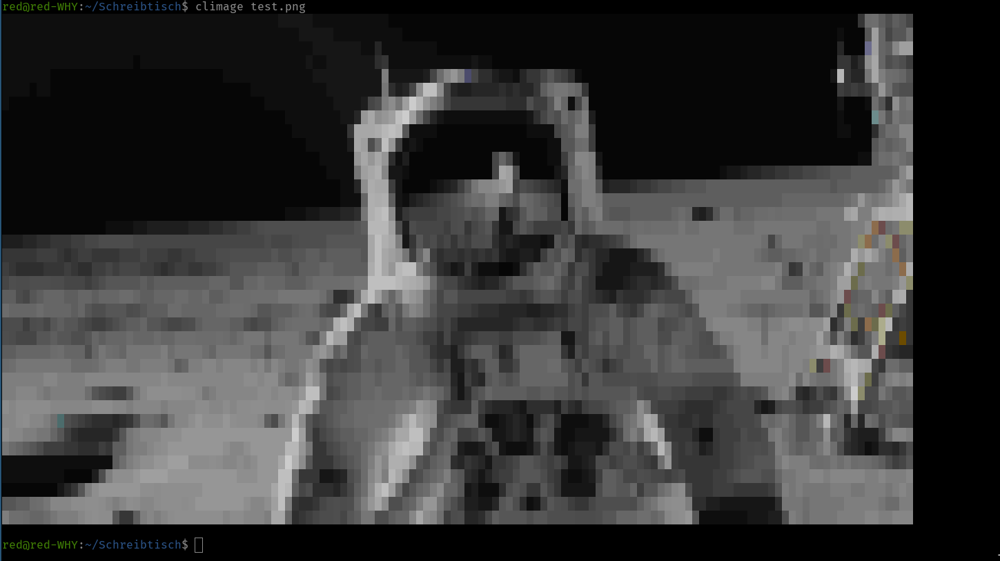

# Climage
Climage is a small Rust command-line utility that displays images in the terminal using Unicode block characters.



## Installation
To use Climage, you will need to have Rust installed on your system. Once you have Rust installed, you can clone the repository and build Climaxe from source:

```bash
git clone https://github.com/your_username/climage.git
cd climage
cargo build --release
```

## Usage
To use Climaxe, simply run the executable and provide the path to the image file you wish to display:

```bash
climage --path path/to/image.png
```

## License
Climage is released under the MIT License.
